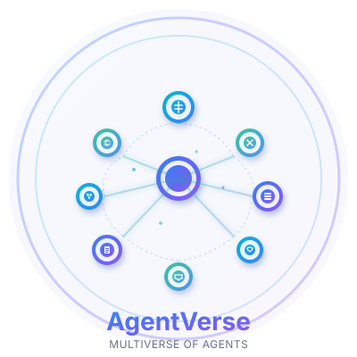

# 🤖 AgentVerse

<div align="center">



**Where AI Agents Collaborate**

A desktop application that lets you create AI agents, give them capabilities, and watch them work together to solve complex problems.

[](https://python.org)
[](https://typescriptlang.org)
[](https://fastapi.tiangolo.com)
[](https://react.dev)
[](https://tauri.app)

</div>

## 💡 The Big Idea

**Think Slack or Microsoft Teams, but your teammates are AI agents** with tools and knowledge you define.

Instead of managing isolated AI chatbots, you orchestrate a team of specialized agents that collaborate, delegate tasks to each other, and access shared knowledge - all running locally on your machine.

## ⚡ Why AgentVerse?

**For Developers:**
- Build once, use everywhere - agents persist and improve with context
- Chain complex workflows through agent collaboration
- Give agents real capabilities through tools and MCP servers
- Full conversation memory and document understanding

**For Teams:**
- Local-first - your data never leaves your machine
- Share agent configurations and workflows
- Collaborative problem-solving with AI assistance
- Extensible through custom tools and integrations

**For Power Users:**
- Multi-agent orchestration made simple
- Rich document intelligence (40+ formats)
- Real-time streaming responses
- Beautiful native desktop experience

## 🎯 What Can You Build?

**Research Assistants**
- Upload papers → Agents analyze, summarize, extract insights
- Multi-document synthesis across formats
- Automatic citation and reference tracking

**Development Teams**
- Code review agent + testing agent + documentation agent
- Automated workflow pipelines
- Access to GitHub, filesystems, databases via MCP

**Content Creation**
- Research → Draft → Edit → Publish pipeline
- Multi-agent brainstorming sessions
- Style consistency across deliverables

**Data Analysis**
- Upload spreadsheets → Statistical analysis + visualization recommendations
- Cross-reference multiple data sources
- Natural language queries on your data

## 🚀 Get Started in 2 Minutes

```bash
# Automated setup (recommended)
./setup.sh && ./start.sh   # macOS/Linux
setup.bat && start.bat      # Windows

# Manual setup
cd backend && pip install -r requirements.txt && python server.py
cd frontend && npm install && npm run dev
```

**Add your LLM API key** to `backend/.env` and you're ready to go!

## 🎬 How It Works

**1. Create Agents**
Define what each agent does - their specialty, personality, and capabilities.

**2. Give Them Tools**
- Custom Python functions
- MCP servers (GitHub, databases, filesystems)
- Access to documents you upload

**3. Start a Conversation**
Create groups, add agents, and @mention them. Watch them collaborate with:
- Real-time streaming responses
- Tool usage (they can code, search, analyze)
- Cross-agent delegation
- Full context awareness

**4. Share Knowledge**
Upload documents (PDFs, code, spreadsheets) - agents automatically get context through semantic search.

## ✨ Key Capabilities

🧠 **Multi-Agent Orchestration** - Agents delegate and collaborate via @mentions

📚 **Document Intelligence** - Upload 40+ formats, agents retrieve relevant context automatically

🔧 **Tool Ecosystem** - Custom Python tools + MCP protocol for infinite extensibility

💬 **Conversation Memory** - Full history with automatic summarization to stay focused

⚡ **Real-time Streaming** - Watch agents think, reason, and execute live

🎨 **Native Desktop** - Beautiful Tauri app, no browser needed

🔒 **Local-First** - Your data stays on your machine, no cloud required

## 🏗️ Under the Hood

**Frontend**: Tauri desktop app (React + TypeScript) on port 1420

**Backend**: FastAPI server (Python) on port 8000

**Storage**: SQLite (conversations) + ChromaDB (documents)

**AI**: LangChain 0.3+ with official tool calling

**Extensibility**: Official Anthropic MCP SDK

**LLM Support**: OpenAI, Anthropic Claude, Google Gemini

> **For Technical Details**: See [frontend/README.md](frontend/README.md) and [backend/README.md](backend/README.md)

## 🎓 Example Workflows

**Code Review Pipeline**
```
1. Upload codebase → Document RAG
2. @code_analyzer review for bugs
3. @security_agent check vulnerabilities
4. @documentation_agent update README
```

**Research Assistant**
```
1. Upload 10 papers (PDFs)
2. @research_agent summarize key findings
3. @synthesis_agent find common themes
4. @writing_agent draft literature review
```

**Content Creation**
```
1. @research_agent gather sources on topic
2. @writer_agent create first draft
3. @editor_agent refine and polish
4. @fact_checker_agent verify claims
```

## 🔧 Configuration Made Simple

**LLM Providers** → Choose OpenAI, Anthropic, or Gemini in settings

**Agent Capabilities** → Drag-drop tools, connect MCP servers

**Document Context** → Upload files, automatic RAG integration

**Memory** → Automatic summarization keeps conversations focused

## 🤝 Perfect For

✅ Developers automating complex workflows

✅ Researchers processing large document sets

✅ Teams needing collaborative AI assistance

✅ Power users wanting control over their AI tools

✅ Anyone who values data privacy (local-first!)

## 🚦 Quick Links

- **Get Started**: Run `./setup.sh` or `setup.bat`
- **API Docs**: http://localhost:8000/docs
- **Frontend Tech**: [frontend/README.md](frontend/README.md)
- **Backend Tech**: [backend/README.md](backend/README.md)

## 🐛 Troubleshooting

**Ports in use?** Kill 8000 (backend) or 1420 (frontend)

**API key errors?** Check `backend/.env` has valid keys

**Module errors?** Activate venv and reinstall: `pip install -r requirements.txt`

**MCP not working?** Ensure Node.js is installed

## 🎯 What's Next?

Your agents improve as they:
- Build conversation context
- Access more documents
- Gain new tools and capabilities
- Learn from delegation patterns

The more you use AgentVerse, the more powerful your agent team becomes.

## 📄 License

MIT License - See LICENSE file for details.

## 🤝 Contributing

We welcome contributions! Fork, branch, commit, and open a PR.

---

**Built with FastAPI, React, LangChain, and Tauri**

*Local-first AI agent collaboration that scales with you* 🌌

